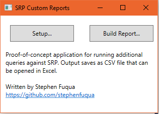
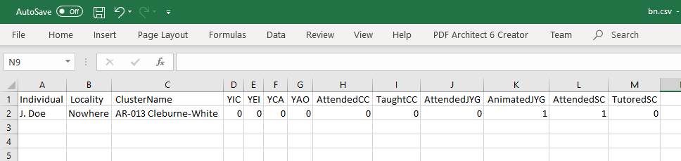

# SRP.CustomReports

This sample application is currently a proof-of-concept for distributing custom
SRP reports out to Cluster Statistics Officers. 

## Getting Started

To run:

1. [Download the latest release](https://github.com/stephenfuqua/SRP.CustomReports/releases) 
   (be sure to download the file `SRP.CustomReports.WPF.zip`, not the source code).
2. Unzip the downloaded file ([Windows help for extracting files](https://support.microsoft.com/en-us/help/4028088/windows-zip-and-unzip-files))
3. Double-click SRP.CustomReports.WPF.exe to run the program.
4. Click the Setup button to select the directory that contains SRP.mdf, the
   database file in which SRP stores its data. Note: the dialog box that lets
   you select the directory unfortunately won't show you the SRP.mdf file. It
   does however set this to the actual default directory that most likely
   contains SRP.mdf.
5. Click the Build Report button to access reports.
6. When you choose a report to run, the program will offer to save a Comma-
   Separated Values (CSV) file for you. These files can be opened in Excel
   or uploaded into Google Sheets. Please note: the file may contain sensitive
   information such as people's names. Treat as confidential, just as you
   would any report coming directly out of SRP.

After the first time you run the program, you should not need to click Setup
again in the future.

## Bundled Reports

### Youth Continuum

Use this report to find all of the youth in a cluster, see which ones have the
youth continuum hash tags applied to them, and compare to actual institute
experience. Example CSV file:

In this example, the youth named J. Doe has attended a study circle and has
animated a junior youth group. Yet, none of the Y__ columns are marked with 1.
That implies that the CSO should open up this person's record and add the
codes `#YIC #YEI #YCA` into the comments. As a reminder:

| Code | Meaning | Description | 
| ---- | ------- |------- |
| YIC  | Youth in Conversation | Always true if already in study circle, also if learning about youth conference materials |
| YEI  | Youth entered institute process | Attending study circle |
| YCA  | Youth carrying out activities | Teaching, animating, or tutoring |
| YAO  | Youth accompanying others | Helping others to teach, animate, or tutor |